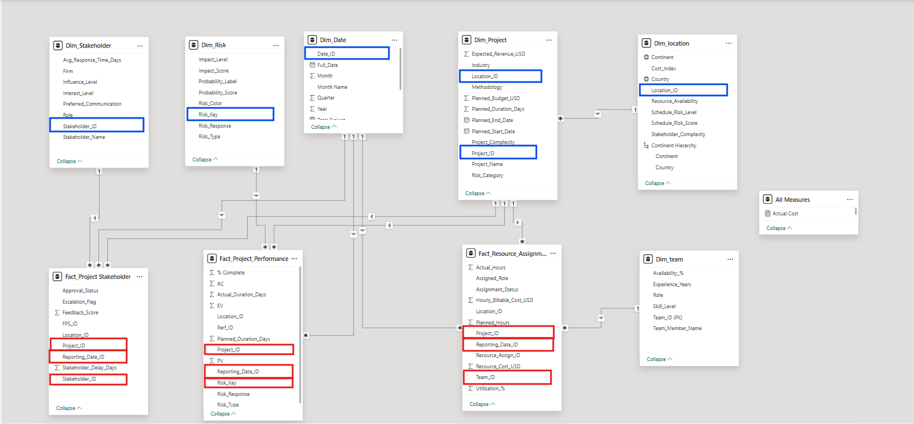
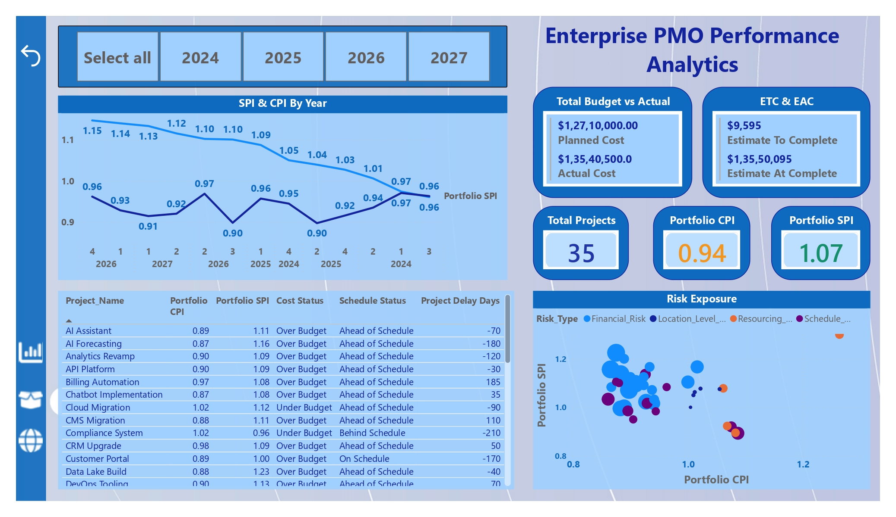

📊 Enterprise PMO Performance Analytics

An end-to-end PMO analytics solution to monitor portfolio health, project performance, and resource efficiency using SQL and Power BI.
________________________________________
📌 Overview

This project simulates a real-world Enterprise Project Management Office (PMO) analytics environment.
It demonstrates how project data can be stored in a relational database, transformed using SQL and ETL practices, and visualized in Power BI to support executive and operational decision-making.
The solution covers portfolio oversight, earned value management, and resource utilization analysis through interactive dashboards.
________________________________________
❓ Problem Statement

Organizations managing multiple projects struggle to:
1.	Track portfolio-level performance in one place
2.	Identify schedule delays and cost overruns early
3.	Monitor resource utilization and efficiency
4.	Provide executives with clear, data-driven insights
This project addresses these challenges by building a structured analytics pipeline from database to dashboard.
________________________________________
📂 Dataset
1.	The dataset is synthetically created for portfolio and learning purposes
2.	It is not sourced from any real organization
3.	Data is periodically updated to simulate ongoing PMO reporting cycles

Data includes:

3 Fact Tables
-	Fact_Project_Performance
-	Fact_Resource_Assignment
-	Fact_Stakeholder

6 Dimension Tables
-	Project, Date, Location, Stakeholder, Team, Risk

 
________________________________________
🛠 Tools and Technologies
1.	MySQL – Database creation, table storage, SQL operations
2.	Power BI – Data modeling, DAX, and dashboard creation
3.	SQL – CRUD operations, data extraction, validation
4.	Excel – Dimension table preparation and data staging
5.	DAX – Calculated columns and measures for KPIs
________________________________________
🔧 Methods
1.	Database Design
-	Created a MySQL database to store all fact tables
-	Defined appropriate data types and primary keys
2.	ETL & Data Preparation
-	Cleaned empty and inconsistent records
-	Standardized formats and merged columns where required
-	Followed normalization rules to avoid redundancy
3.	Data Modeling
-	Implemented a star schema
-	Connected 3 fact tables to 6 dimension tables
-	Ensured one-to-many relationships using primary and foreign keys
4.	DAX Calculations
-	Created calculated columns in fact tables (e.g., utilization %, variances)
-	Built measures using:
1.	SUM, AVERAGE, DIVIDE, SUMX, AVERAGEX
2.	DATE, MONTH, YEAR, FORMAT
3.	CALCULATE, FILTER, RELATED
4.	Time-Intelligence aggregations for trend analysis
________________________________________
📈 Key Insights
1.	Identified projects that are over budget or behind schedule
2.	Highlighted resource overload and underutilization
3.	Compared planned vs actual performance using Earned Value metrics
4.	Enabled leadership to prioritize high-risk projects
________________________________________
📊 Dashboards / Model / Output

Dashboard 1: Executive Portfolio Overview
-	Overall portfolio health
-	Cost, schedule, and risk KPIs
-	High-level executive summary
 

Dashboard 2: Project Performance & Earned Value Analysis
-	PV, EV, AC analysis
-	CPI & SPI trends
-	Project-level performance deep dive

 
Dashboard 3: Location & Resource Efficiency Analysis
-	Resource utilization %
-	Planned vs actual effort
-	Location-based efficiency comparison
 
________________________________________
▶️ How to Run This Project?
1.	Clone this repository
2.	Import SQL scripts into MySQL Workbench
3.	Load dimension tables from Excel into Power BI
4.	Connect Power BI to MySQL using the MySQL connector
5.	Refresh data and explore dashboards
________________________________________
✅ Results & Conclusion

This project demonstrates how SQL, data modeling, and Power BI can be combined to create a robust PMO analytics solution.
It provides actionable insights for executives and project managers while following industry best practices in ETL, normalization, and BI design.
________________________________________
🔮 Future Work
-	Add forecasting and trend-based KPIs
-	Implement row-level security (RLS)
-	Automate data refresh pipelines
-	Expand analysis to vendor and quality metrics
________________________________________
👤 Author & Contact

Priyansh Saxena

🎓 Engineering Management Graduate | CAPM® Certified

📊 Aspiring Project Coordinator / PMO / Project Analyst

🔗 LinkedIn: https://www.linkedin.com/in/priyanshsaxena1995

💻 GitHub: https://github.com/Priyansh21-hub

